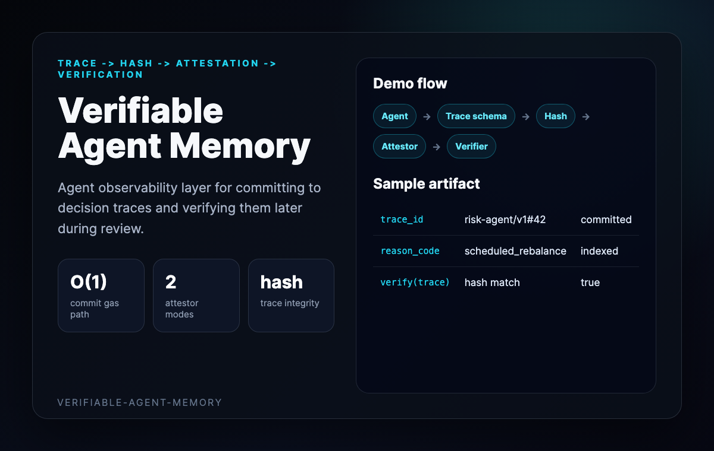
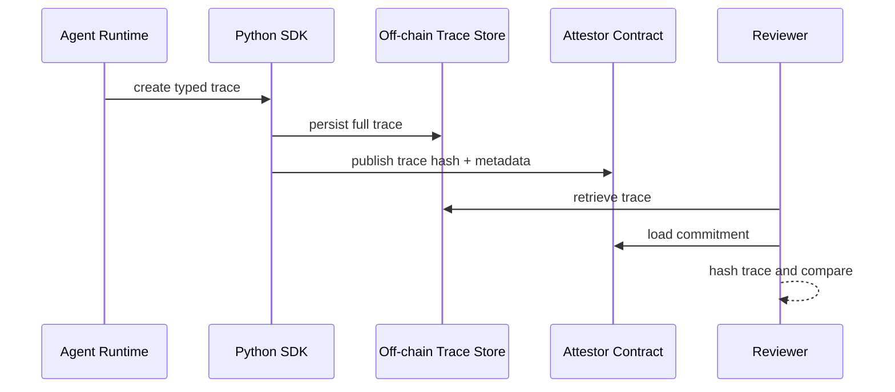
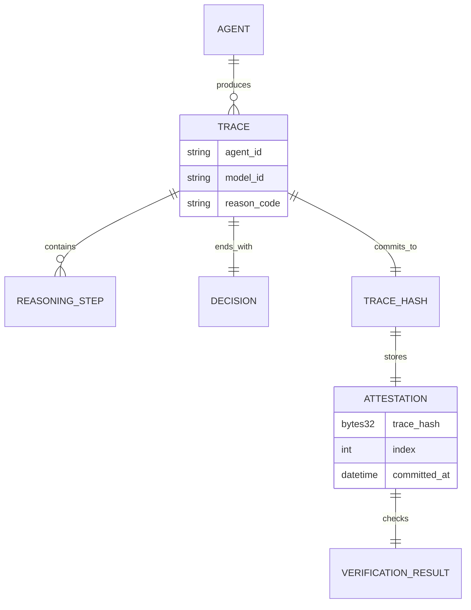
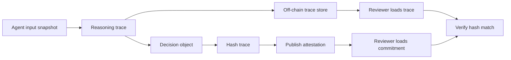

# Verifiable Agent Memory Demo

This walkthrough presents the repo as an observability layer for AI agent
decision traces.



## Sequence Diagram



## Entity Graph



## Flow Chart



## Sample Verification Result

```json
{
  "agent_id": "risk-agent/v1",
  "trace_id": "risk-agent/v1#42",
  "reason_code": "scheduled_rebalance",
  "on_chain_index": 42,
  "trace_hash": "0xabc...",
  "match": true
}
```
